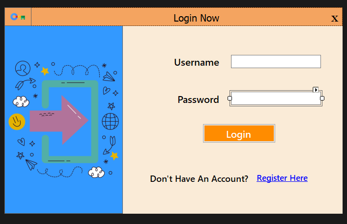
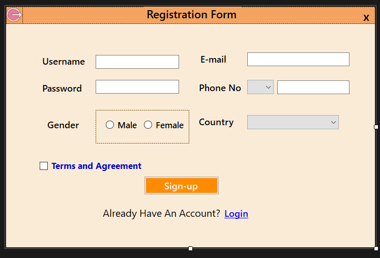
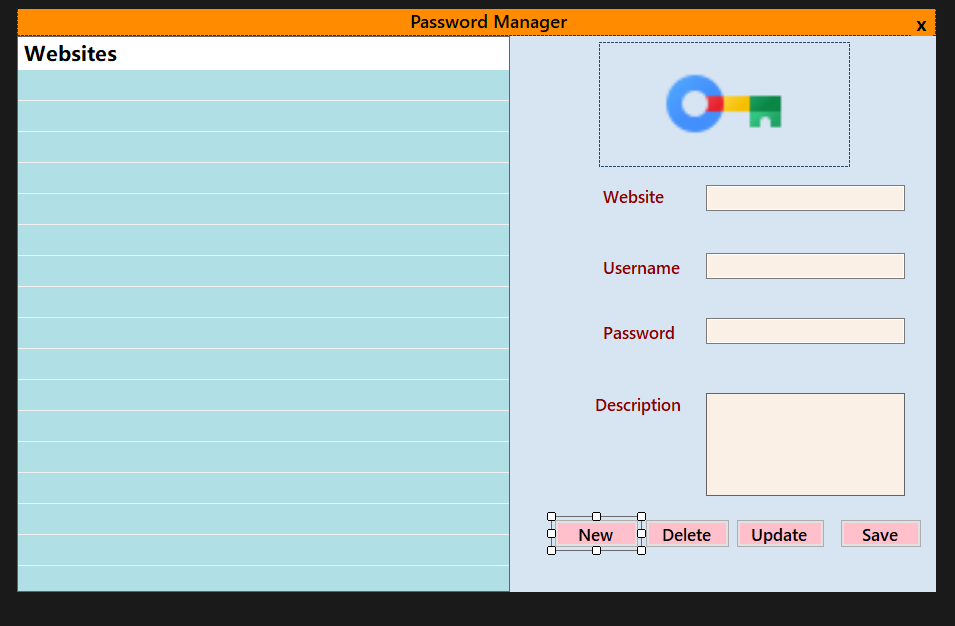

# 🔐 Password Manager

Welcome to **Password Manager**! This simple and secure application helps you store and manage your passwords for various websites safely. With an easy-to-use interface, you can register, log in, and manage your password entries with ease.

---

## 📸 Screenshots

Here’s a sneak peek at the user interface of the application:

### 1. 🔑 **Login Screen**
This is the screen where you can log in to your account.



---

### 2. 📝 **Registration Screen**
If you're a new user, you can register by entering your details here.



---

### 3. 🗂️ **Main Dashboard**
Once logged in, this is the main interface where you can view, add, edit, and delete your saved passwords.



---

## ✨ Features

- **Secure Password Storage**: All your passwords are safely stored in the database.
- **User Registration and Login**: Create a new account or log in to your existing one.
- **Add, Edit, and Delete Entries**: Manage your passwords easily.
- **Notes Section**: Add any additional information you might need for each website.
- **User-friendly Interface**: Clean, modern design built with **C#** and **Windows Forms**.

---

## 🛠️ Technologies Used

- **C# (Windows Forms)** for UI development
- **SQL Server** for database management
- **Visual Studio** for development
- **GitHub** for version control

---

## 🚀 How to Get Started

Follow these steps to get the Password Manager running on your machine:

### 1. Clone the Repository

Start by cloning the repository to your local machine:

```bash
git clone https://github.com/your-username/password-manager.git

